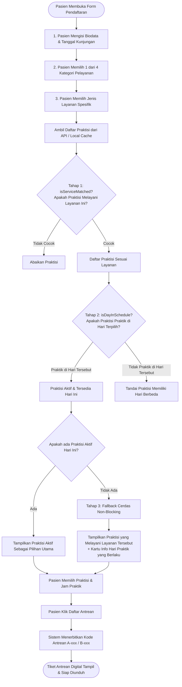
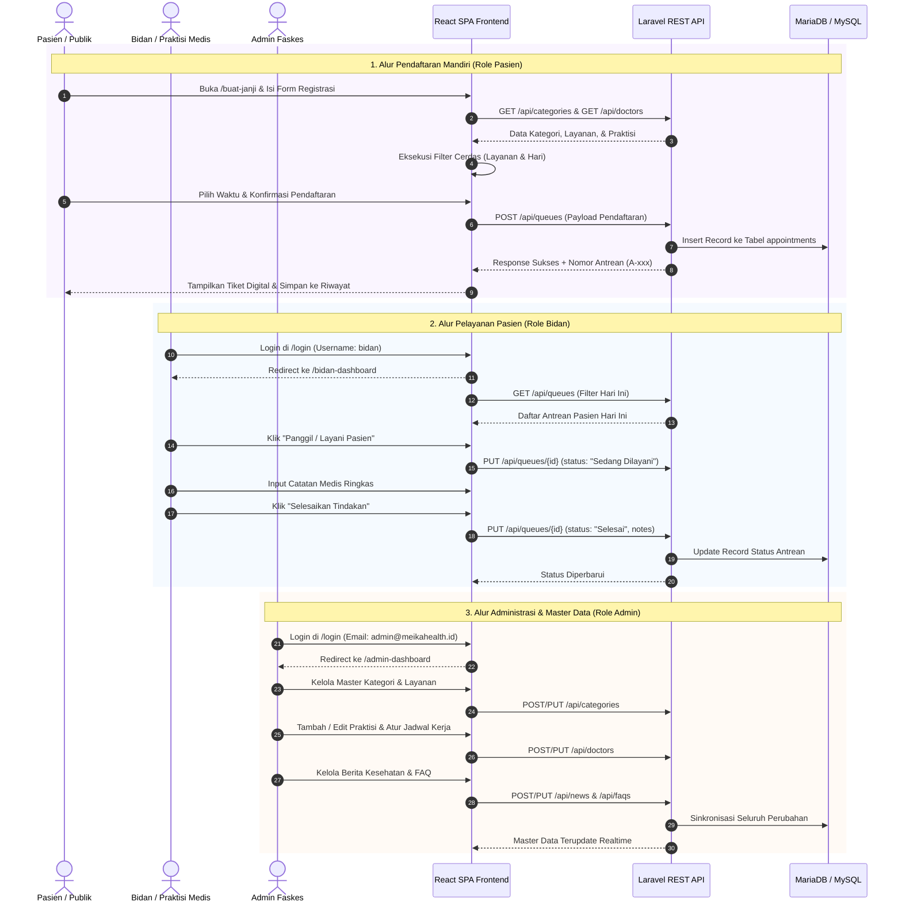
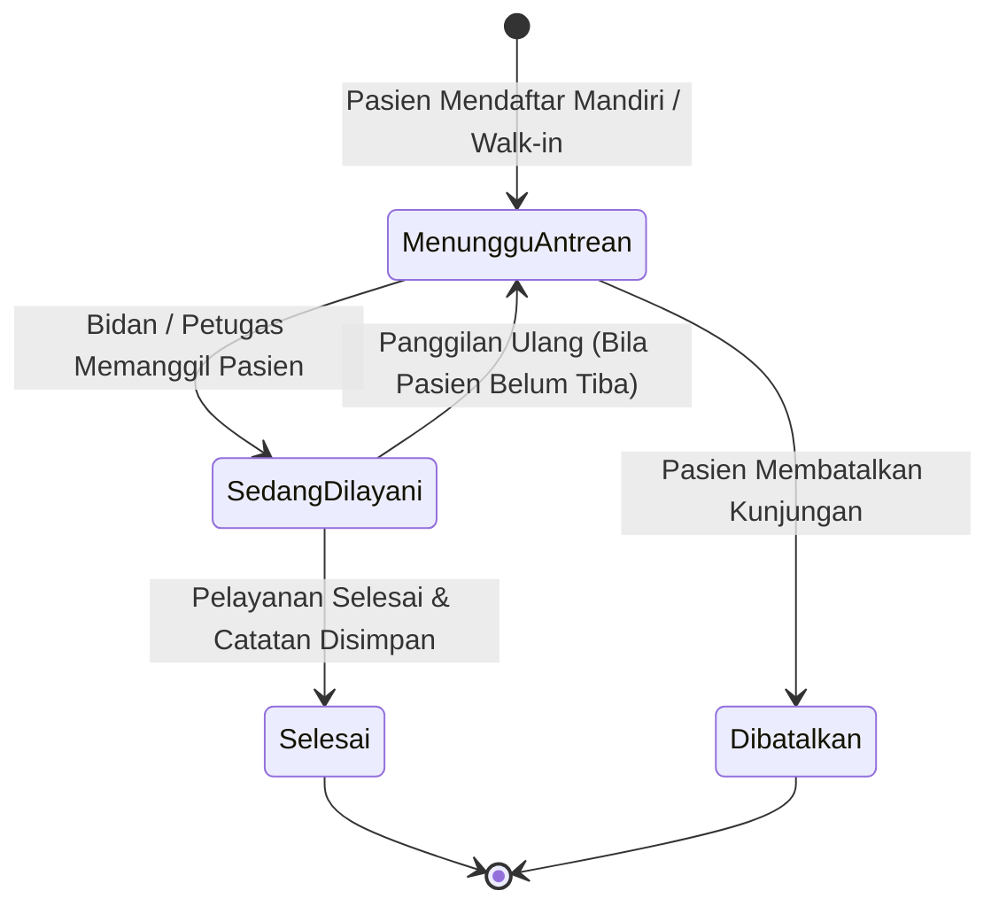
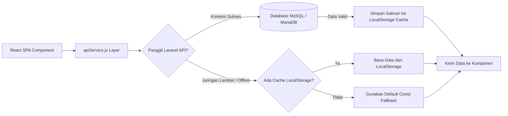

# JnC Family Care Metro - Sistem Informasi Pelayanan Pasien (Fokus Ibu & Anak)

Sistem Informasi Pelayanan Pasien Berbasis Web terintegrasi yang dirancang khusus untuk **Pelayanan Kesehatan Ibu dan Anak** (Tempat Praktik Mandiri Bidan / TPMB & Klinik Meika Healthcare / JnC Family Care Metro). Platform ini memfasilitasi pendaftaran pasien mandiri secara online (terinspirasi alur cerdas Mobile JKN), pengelolaan slot antrean digital real-time, manajemen jadwal praktik bidan dan dokter, katalog kategori pelayanan terstandarisasi, serta portal administrasi dan rekam medis ringkas terpadu.

---

## 1. Overview Sistem

Sistem ini mentransformasi alur pendaftaran dan manajemen antrean klinik konvensional menjadi ekosistem digital yang modern, efisien, dan transparan. Melalui platform ini, pasien dan keluarga dapat mendaftar dari rumah, memilih praktisi medis sesuai preferensi dan jam aktif, memantau antrean harian secara langsung, serta mengakses edukasi kesehatan ibu dan anak.

### Nilai Utama & Tujuan Sistem
- **Pendaftaran Mandiri Pasien (Mobile-First Experience)**: Pasien dapat memilih kategori, jenis layanan, praktisi medis, dan waktu kunjungan secara transparan, serta langsung mengunduh tiket antrean digital dengan kode urut otomatis (misal `A-001`, `B-001`).
- **Penyaringan Praktisi Cerdas (Smart Practitioner Matching)**: Menghubungkan layanan yang dipilih dengan kompetensi praktisi secara fleksibel serta memverifikasi ketersediaan jadwal hari dan jam praktik tanpa membingungkan pasien.
- **Dukungan Multi-Role Terpadu**: Menyediakan antarmuka khusus untuk **Pasien/Pengunjung**, **Bidan/Praktisi Medis** (pemanggilan antrean & rekam catatan pelayanan), dan **Administrator Klinik** (manajemen master data, jadwal, dan audit operasional).
- **Arsitektur Hibrida Tangguh (High Resilience)**: Mengombinasikan REST API Laravel berbasis database MySQL/MariaDB dengan sinkronisasi reaktif `localStorage` di browser untuk memastikan sistem tetap responsif meski dalam kondisi jaringan lambat atau server hosting mengalami perawatan berkala.
- **Dukungan Deployment Fleksibel**: Siap dijalankan dengan **Docker Compose** (lokal), manual **PHP + Vite**, maupun arsitektur split-root aman untuk **cPanel Shared Hosting**.

---

## 2. Struktur Blueprint Direktori Proyek

Sistem ini memiliki dua blueprint struktur: **Lingkungan Pengembangan Monorepo (`code/project/`)** dan **Arsitektur Deployment Produksi cPanel (`code/cpanel/`)**.

### A. Blueprint Direktori Pengembangan Lokal (`code/project/`)

```text
code/project/
├── .docker/                                 # Konfigurasi Apache VirtualHost untuk Docker
│   └── vhost.conf                           # Konfigurasi DocumentRoot Apache ke /var/www/html/public
├── app/                                     # Core Backend Laravel 11/13
│   ├── Http/
│   │   ├── Controllers/
│   │   │   └── Api/                         # Controller REST API JSON
│   │   │       ├── CategoryController.php   # CRUD Kategori & Relasi Layanan
│   │   │       ├── DoctorController.php     # CRUD Praktisi Medis & Jadwal (getDaysRange)
│   │   │       ├── FaqController.php        # CRUD Pertanyaan Umum (FAQ)
│   │   │       ├── NewsController.php       # CRUD Artikel Edukasi Kesehatan
│   │   │       ├── PatientController.php    # Manajemen Data Pasien Terdaftar
│   │   │       └── QueueController.php      # Penerbitan Tiket Antrean & Update Status
│   │   └── Middleware/                      # HTTP Middlewares
│   └── Models/                              # Eloquent ORM Data Models
│       ├── Appointment.php                  # Model Antrean / Kunjungan Pasien
│       ├── Faq.php                          # Model FAQ Klinik
│       ├── News.php                         # Model Berita / Artikel Edukasi
│       ├── Patient.php                      # Model Data Induk Pasien
│       ├── Practitioner.php                 # Model Bidan & Dokter
│       ├── Service.php                      # Model Layanan Medis
│       ├── ServiceCategory.php              # Model 4 Kategori Pelayanan
│       └── User.php                         # Model Akun Pengguna / Admin
├── bootstrap/                               # File Bootstrapping Laravel & Container Dependency
│   └── app.php                              # Inisialisasi Framework, Routing API & Web
├── config/                                  # Konfigurasi Database, App, Cache, Logging
├── database/                                # Database Migrations, Factories, & Seeders
│   ├── migrations/
│   │   ├── 0001_01_01_000000_create_users_table.php
│   │   └── 2026_08_11_000001_create_clinic_tables.php  # Schema seluruh tabel klinik
│   └── seeders/
│       └── DatabaseSeeder.php               # Seeder 4 Kategori, Layanan, Bidan, Dokter, FAQ, & Artikel
├── public/                                  # Web Root Publik Lokal
│   ├── index.php                            # Entry point PHP HTTP Kernel
│   └── robots.txt
├── resources/                               # Frontend Source Code (React 18 + Vite)
│   ├── css/
│   │   └── index.css                        # Design System, CSS Variables, & Tailwind Directives
│   ├── js/
│   │   ├── components/                      # UI Components Reusable
│   │   │   ├── BlogEditor/                  # Editor Konten Artikel Edukasi
│   │   │   ├── Button/                      # Tombol Interaktif dengan Variasi Warna
│   │   │   ├── DashboardLayout/             # Layout Dashboard dengan Sidebar Dinamis
│   │   │   ├── Input/                       # InputText, InputSelect, InputImage
│   │   │   ├── Loading/                     # Skeleton & Spinner Loading
│   │   │   ├── Modal/                       # Dialog & Pop-up Modal Interaktif
│   │   │   ├── Nav/                         # Navbar Navigasi Pasien & Publik
│   │   │   ├── NewsSection/                 # Komponen Kartu Edukasi & Berita
│   │   │   ├── PageWrapper/                 # Wrapper Halaman Konsisten
│   │   │   ├── Table/                       # Komponen Tabel Responsif & TableBadge
│   │   │   └── Title/                       # Tipografi Header Halaman
│   │   ├── pages/                           # Tampilan Halaman Utama (SPA Pages)
│   │   │   ├── AdminDashboard/              # Portal Manajemen Administrator Klinik
│   │   │   ├── ArtikelPage/                 # Portal Pembaca Artikel Edukasi
│   │   │   ├── BidanDashboard/              # Portal Khusus Bidan (Pemanggilan & Catatan)
│   │   │   ├── CariDokter/                  # Pencarian & Direktori Praktisi Medis
│   │   │   ├── Fasilitas/                   # Galeri & Fasilitas Penunjang Medis
│   │   │   ├── LandingPage/                 # Halaman Utama Beranda Klinik
│   │   │   ├── Login/                       # Autentikasi Pengguna (Admin & Bidan)
│   │   │   ├── NewAppointment/              # Formulir Pendaftaran Mandiri Pasien Online
│   │   │   ├── TentangKami/                 # Profil Faskes, Visi, Misi, & Legalitas
│   │   │   └── UserDashboard/               # Portal Pasien: Cek Antrean Real-time & Riwayat
│   │   ├── services/
│   │   │   └── apiService.js                # API Client Layer (Axios, Fallback Data, LocalStorage Sync)
│   │   ├── App.jsx                          # Deklarasi Routing SPA (React Router DOM)
│   │   └── main.jsx                         # React DOM Mount Entrypoint
│   └── views/
│       └── app.blade.php                    # Shell HTML Dasar yang Me-load Bundle Vite
├── routes/
│   ├── api.php                              # Definisi REST API Endpoints (/api/categories, /api/queues, dll.)
│   ├── console.php                          # Artisan CLI Commands
│   └── web.php                              # Catch-All Route Mengarahkan Permintaan Web ke React SPA
├── storage/                                 # Log Aplikasi, Cache Framework, & Upload Aset
├── tests/                                   # Pengujian Unit & Fitur (PHPUnit)
├── .env.example                             # Master Konfigurasi Environment Lokal
├── composer.json                            # Dependensi PHP & Framework Laravel
├── Dockerfile                               # Image Builder PHP 8.2 + Apache + Ekstensi MySQL
├── docker-compose.yml                       # Orkestrasi Docker (Laravel App, MariaDB, phpMyAdmin)
├── package.json                             # Dependensi Node.js & Script Vite
└── vite.config.js                           # Konfigurasi Bundler Vite & Plugin React
```

---

### B. Blueprint Deployment cPanel Produksi (`code/cpanel/`)

Untuk keamanan tingkat enterprise pada shared hosting cPanel, sistem dipisahkan menjadi dua bagian independen (*Dual-Root Architecture*):
1. **Di Luar Web Root (`laravel_core/`)**: Berisi kode sumber backend, logika aplikasi, `.env`, konfigurasi, dan database logic agar tidak dapat diakses secara publik oleh browser.
2. **Di Dalam Web Root (`public_html/`)**: Hanya berisi file statis hasil kompilasi Vite (JS, CSS, images, fonts), file `.htaccess` rewrite, dan `index.php` yang menghubungkan request browser ke `laravel_core`.

```text
code/cpanel/
├── laravel_core/                            # BACKEND & LOGIKA APLIKASI (Folder Target: /home/username/laravel_core/)
│   ├── app/                                 # Controllers, Models, Middleware
│   ├── bootstrap/                           # Autoloader & app.php
│   ├── config/                              # File konfigurasi sistem
│   ├── database/                            # Migrations & Seeders
│   ├── routes/                              # api.php & web.php
│   ├── storage/                             # Storage log & cache (Permission 775)
│   ├── vendor/                              # Dependensi PHP Composer lengkap
│   ├── .env                                 # Konfigurasi kredensial database & APP_URL produksi
│   └── artisan                              # Artisan CLI tool
│
├── public_html/                             # FRONTEND WEB ROOT (Folder Target: /home/username/public_html/)
│   ├── build/                               # Bundle hasil build Vite
│   │   ├── assets/                          # Kompilasi JS (main-*.js) & CSS (main-*.css)
│   │   └── manifest.json                    # Peta aset Vite
│   ├── img/                                 # Seluruh aset visual & ilustrasi klinik
│   ├── fonts/                               # Font lokal antarmuka
│   ├── .htaccess                            # Rule mod_rewrite Apache untuk SPA & API
│   ├── index.php                            # Bridge Bootstrap: memanggil ../laravel_core/bootstrap/app.php
│   └── robots.txt                           # Aturan crawler mesin pencari
│
├── laravel_core.zip                         # File arsip backend siap ekstrak di Root cPanel
├── public_html.zip                          # File arsip web asset siap ekstrak di public_html
└── pelayanan_pasien.sql                     # Dump database MySQL lengkap dengan 4 kategori & master data
```

---

## 3. Alur Logika Sistem (System Logic & Core Workflows)

### A. Alur Logika Pendaftaran Pasien & Filter Cerdas Praktisi

Salah satu fitur paling krusial pada sistem ini adalah **Penyaringan Praktisi Cerdas (Smart Practitioner Matching)**. Alur ini memastikan bahwa pasien selalu menemukan dokter/bidan yang tepat sesuai kebutuhan tanpa terjadinya kekosongan opsi akibat kesalahan hari atau pencocokan string nama layanan yang kaku.



#### Rincian Algoritma 3 Tahap Penapisan Praktisi:

1. **Flexible Service Matching (`isServiceMatched`)**:
   - Membandingkan jenis layanan yang dipilih pasien dengan daftar kompetensi praktisi (`practitioner.services`).
   - Melakukan normalisasi huruf kecil (*case-insensitive*) dan penghapusan spasi ganda.
   - Menggunakan pencocokan dua arah (*bidirectional substring matching*), sehingga variasi penulisan seperti `"Pemeriksaan Kehamilan"` akan cocok dengan `"Pemeriksaan Kehamilan (ANC)"`, dan `"Baby Spa"` akan mencakup `"Paket Baby Spa"`.

2. **Ekspansi Siklik Rentang Hari (`getDaysRange` & `isDayInSchedule`)**:
   - Jadwal praktisi pada basis data disimpan dalam format hari awal dan hari akhir (misalnya `start_day = "Selasa"` dan `end_day = "Minggu"`).
   - Algoritma `getDaysRange()` mengonversi rentang tersebut ke dalam array seluruh hari aktif secara siklik berdasarkan urutan hari di Indonesia: `["Senin", "Selasa", "Rabu", "Kamis", "Jumat", "Sabtu", "Minggu"]`.
   - Hasilnya, bila pasien memilih hari Kamis atau Sabtu, sistem secara presisi mengenali bahwa tanggal tersebut berada dalam rentang kerja praktisi.

3. **Mekanisme Fallback Non-Blocking & UX Resilience**:
   - Jika praktisi melayani layanan yang diinginkan namun tidak memiliki jadwal di tanggal yang dipilih pasien, sistem **tidak akan menyembunyikan praktisi secara sepihak** (yang menyebabkan dropdown kosong membingungkan).
   - Sistem akan tetap menampilkan opsi praktisi disertai **Badge Jadwal Berbeda** dan **Kartu Rekomendasi Jadwal**, sehingga pasien dapat memilih untuk tetap mendaftar atau menyesuaikan tanggal kunjungannya.

---

### B. Alur Logika Multi-Role (Pasien, Bidan, dan Admin)

Sistem mengadopsi prinsip *Role-Based Access Control (RBAC)* dengan hak akses terpisah:



#### Matriks Hak Akses Peran:

| Fitur & Modul | Pasien / Publik | Bidan / Praktisi | Admin Klinik |
| :--- | :---: | :---: | :---: |
| Akses Landing Page, Fasilitas, & Edukasi | ✅ | ✅ | ✅ |
| Pendaftaran Mandiri & Penerbitan Tiket Antrean | ✅ | ❌ | ✅ (Walk-in) |
| Pemantauan Nomor Antrean Real-time | ✅ | ✅ | ✅ |
| Pembatalan Antrean Mandiri | ✅ (Tiket Sendiri) | ❌ | ✅ (Semua) |
| Dashboard Khusus Bidan (`/bidan-dashboard`) | ❌ | ✅ | ❌ |
| Pemanggilan Antrean (`Sedang Dilayani`) | ❌ | ✅ | ✅ |
| Penyelesaian Tindakan (`Selesai`) & Catatan Medis | ❌ | ✅ | ✅ |
| Pengaturan Hari & Jam Praktik Mandiri | ❌ | ✅ | ✅ |
| Dashboard Master Admin (`/admin-dashboard`) | ❌ | ❌ | ✅ |
| CRUD Master Kategori, Layanan, & Praktisi | ❌ | ❌ | ✅ |
| CRUD Berita/Artikel & FAQ Faskes | ❌ | ❌ | ✅ |

---

### C. Siklus Hidup Status Antrean (Queue Lifecycle)

Status antrean pada sistem ini merepresentasikan siklus kunjungan pasien dari pendaftaran hingga selesai mendapatkan tindakan:



- **Menunggu Antrean**: Status awal saat tiket diterbitkan. Nomor antrean otomatis terurut dengan prefix `A-` (layanan poli/umum) atau `B-` (layanan kebidanan khusus).
- **Sedang Dilayani (Dipanggil)**: Bidan atau petugas menekan tombol panggil. Status ini memberi notifikasi visual pada dashboard pasien bahwa giliran mereka telah tiba.
- **Selesai**: Pasien telah selesai mendapatkan tindakan, konsultasi, atau persalinan. Bidan dapat melampirkan catatan rekam medis ringkas.
- **Dibatalkan**: Pasien atau admin dapat membatalkan kunjungan jika berhalangan hadir.

---

### D. Arsitektur Sinkronisasi Data Hibrida (Dual-Tier Storage)

Sistem mengadopsi mekanisme *Dual-Tier Storage* antara database MySQL (via REST API) dan browser `localStorage`:



- **Single Source of Truth**: Database MySQL/MariaDB pada server Laravel adalah sumber data utama.
- **Toleransi Gangguan (Self-Healing)**: Ketika koneksi jaringan terputus atau server hosting sedang dalam pemeliharaan sementara, `apiService.js` secara otomatis membaca data dari cache `localStorage` (`clinic_queues`, `clinic_doctors`, `clinic_categories`), sehingga antarmuka tetap berjalan mulus tanpa layar putih atau galat fatal.

---

## 4. Arsitektur Database (Entity-Relationship Diagram)

Database dirancang menggunakan pendekatan relasional ternormalisasi untuk menjamin integritas data:

```mermaid
erDiagram
    users {
        bigint id PK
        string name
        string email UK
        string password
        timestamp email_verified_at
        timestamps created_at_updated_at
    }

    service_categories {
        bigint id PK
        string title UK "Poli, Mom's Treatment, Persalinan, Pelayanan Bayi dan Anak"
        timestamps created_at_updated_at
    }

    services {
        bigint id PK
        bigint category_id FK
        string name "Nama spesifik layanan"
        timestamps created_at_updated_at
    }

    practitioners {
        bigint id PK
        string doctor "Nama lengkap & gelar praktisi"
        string role "Spesialisasi profesi"
        string image "Path foto profil"
        string start_day "Hari awal praktik (misal: Senin)"
        string end_day "Hari akhir praktik (misal: Sabtu)"
        string start_time "Jam mulai praktik (misal: 08:00)"
        string end_time "Jam selesai praktik (misal: 16:00)"
        json services "Daftar layanan yang dapat dilayani"
        timestamps created_at_updated_at
    }

    appointments {
        bigint id PK
        string queue_number "Kode antrean otomatis (A-001 / B-001)"
        string patient_name "Nama pasien"
        string doctor_name "Nama dokter / bidan yang dipilih"
        string category_name "Kategori pelayanan"
        string service_name "Jenis layanan spesifik"
        string date "Tanggal kunjungan (YYYY-MM-DD)"
        string time "Waktu / jam kedatangan"
        string status "Menunggu Antrean / Sedang Dilayani / Selesai / Dibatalkan"
        text notes "Catatan medis ringkas"
        timestamps created_at_updated_at
    }

    patients {
        bigint id PK
        string name
        string nik "Nomor Induk Kependudukan (Opsional)"
        string phone
        string address
        date birth_date
        timestamps created_at_updated_at
    }

    news {
        bigint id PK
        string title
        string category
        text summary
        longtext content
        string author
        string image
        string read_time
        string date
        timestamps created_at_updated_at
    }

    faqs {
        bigint id PK
        text question
        text answer
        timestamps created_at_updated_at
    }

    service_categories ||--o{ services : "memiliki banyak layanan"
```



---

## 5. Master 4 Kategori Resmi Pelayanan Faskes

Klinik JnC Family Care Metro memiliki 4 kategori pelayanan resmi berstandar kesehatan ibu dan anak:

```
├── 1. Poli (Kebidanan & Kandungan)
│   ├── Prenatal Class Yoga
│   ├── Aquatic Yoga
│   ├── Kelas Melahirkan
│   ├── KB (Keluarga Berencana)
│   ├── Pemeriksaan / Konsultasi Catin (Calon Pengantin)
│   ├── Pemeriksaan Nifas
│   ├── Pemeriksaan Kehamilan (ANC)
│   ├── IVA Test
│   ├── Papsmear
│   └── Washing V
│
├── 2. Mom's Treatment (Perawatan Relaksasi & Pasca Melahirkan)
│   ├── Special Pregnant Treatment
│   ├── Treatment Laktasi
│   ├── Treatment Babaran
│   ├── Totok Wajah
│   ├── Body Massage
│   ├── Ratus V
│   ├── Steambath
│   ├── Lulur
│   ├── Scrub
│   ├── Creambath
│   └── Footbath
│
├── 3. Persalinan (Maternity & Delivery Care)
│   ├── Pelayanan Persalinan 24 Jam
│   ├── Inisiasi Menyusu Dini (IMD)
│   ├── Pendampingan Persalinan Lembut (Gentle Birth Support)
│   └── Delayed Cord Clamping (DCC)
│
└── 4. Pelayanan Bayi dan Anak (Pediatric & Newborn Care)
    ├── Baby Infant & Kids Massage
    ├── Massage Terapi (Common Cold / Diare / Konstipasi / Kolik / Kembung)
    ├── Skrining Hipotiroid Kongenital (SHK)
    ├── Konsultasi Tumbuh Kembang Anak
    ├── MTBS / MTBM
    ├── Cukur Rambut Bayi
    ├── Terapi Jemur Bayi
    ├── Imunisasi Dasar & Lanjutan
    ├── Baby Spa & Hydrotherapy
    ├── Potong Kuku & Perawatan Tali Pusat
    ├── Mandi Bayi & Edukasi Ibu
    ├── Pemeriksaan Golongan Darah Bayi
    ├── Higienitas Lidah, Telinga, & Hidung
    └── Tindik Daun Telinga Steril
```

---

## 6. Katalog REST API Endpoints

Seluruh komunikasi frontend React menggunakan endpoint RESTful JSON terstandarisasi:

| Method | Endpoint | Deskripsi Fungsi | Request Body / Param |
| :--- | :--- | :--- | :--- |
| **GET** | `/api/categories` | Mendapatkan seluruh kategori beserta relasi layanannya | - |
| **POST** | `/api/categories` | Menambahkan kategori pelayanan baru (Admin) | `{ title: string }` |
| **PUT** | `/api/categories/{id}` | Memperbarui nama kategori | `{ title: string }` |
| **DELETE** | `/api/categories/{id}` | Menghapus kategori | - |
| **GET** | `/api/doctors` | Mendapatkan seluruh data praktisi medis, jadwal, & layanan | - |
| **POST** | `/api/doctors` | Menambahkan dokter/bidan baru (Admin) | `{ doctor, role, start_day, end_day, start_time, end_time, services }` |
| **PUT** | `/api/doctors/{id}` | Memperbarui data praktisi atau jadwal kerja | Payload field praktisi |
| **DELETE** | `/api/doctors/{id}` | Menghapus data praktisi medis | - |
| **GET** | `/api/queues` | Mendapatkan daftar antrean pasien klinik | Query params: `?date=YYYY-MM-DD` |
| **POST** | `/api/queues` | Mendaftarkan antrean baru (Pasien Mandiri / Walk-in) | `{ patientName, doctor, service, category, date, time }` |
| **PUT** | `/api/queues/{id}` | Mengubah status antrean (`Sedang Dilayani`, `Selesai`, dll.) | `{ status: string, notes?: string }` |
| **DELETE** | `/api/queues/{id}` | Menghapus riwayat antrean | - |
| **GET** | `/api/news` | Mendapatkan daftar artikel edukasi kesehatan | - |
| **POST** | `/api/news` | Mempublikasikan artikel edukasi baru (Admin) | `{ title, category, summary, content, author, image }` |
| **GET** | `/api/faqs` | Mendapatkan daftar FAQ klinik | - |
| **POST** | `/api/faqs` | Menambahkan pertanyaan & jawaban FAQ | `{ question, answer }` |

---

## 7. Panduan Instalasi & Menjalankan Sistem

### Prasyarat Sistem
- **Node.js**: Versi 18+ & NPM
- **PHP**: Versi 8.2+
- **Composer**: Versi 2.x
- **Database**: MariaDB 10.4+ atau MySQL 8.0+
- *(Opsional)* **Docker & Docker Compose**

---

### Metode A: Menjalankan Menggunakan Docker Compose (Rekomendasi Lokal)

Dengan Docker Compose, seluruh lingkungan PHP 8.2, Apache, MariaDB, dan phpMyAdmin akan langsung diorkestrasikan tanpa perlu instalasi manual pada sistem operasi induk.

1. **Masuk ke Direktori Proyek**:
   ```bash
   cd code/project
   ```

2. **Salin File Konfigurasi Environment**:
   ```bash
   cp .env.example .env
   ```

3. **Nyalakan Container Docker**:
   ```bash
   docker compose up -d
   ```
   *Layanan Docker akan aktif pada port:*
   - **Aplikasi Web**: [http://localhost:8000](http://localhost:8000)
   - **Database MariaDB**: `localhost:3306`
   - **phpMyAdmin**: [http://localhost:8081](http://localhost:8081)

4. **Inisialisasi Kunci Aplikasi & Database Seeder**:
   ```bash
   docker exec -it laravel_app php artisan key:generate
   docker exec -it laravel_app php artisan migrate:fresh --seed
   ```

5. **Jalankan Frontend Vite (Development Mode)**:
   ```bash
   npm install
   npm run dev
   ```

---

### Metode B: Menjalankan Manual Non-Docker (Laragon / XAMPP / Native)

1. **Masuk ke Direktori Proyek**:
   ```bash
   cd code/project
   ```

2. **Install Dependensi Backend & Frontend**:
   ```bash
   composer install
   npm install
   ```

3. **Konfigurasi File Environment (`.env`)**:
   ```bash
   cp .env.example .env
   ```
   Sesuaikan parameter database di file `.env`:
   ```env
   DB_CONNECTION=mysql
   DB_HOST=127.0.0.1
   DB_PORT=3306
   DB_DATABASE=pelayanan_pasien
   DB_USERNAME=root
   DB_PASSWORD=
   ```

4. **Generate Key & Eksekusi Migrasi Database**:
   Buat database kosong bernama `pelayanan_pasien` di MySQL Anda, lalu jalankan:
   ```bash
   php artisan key:generate
   php artisan migrate:fresh --seed
   ```

5. **Jalankan Server Pengembangan**:
   ```bash
   # Jalankan bersamaan via concurrently:
   composer dev
   ```
   *Atau jalankan pada dua jendela terminal terpisah:*
   ```bash
   # Terminal 1 (Backend Laravel API):
   php artisan serve --port=8000

   # Terminal 2 (Frontend React Vite SPA):
   npm run dev
   ```
   Aplikasi siap diakses pada browser di [http://localhost:8000](http://localhost:8000).

---

### Metode C: Panduan Deployment ke cPanel Hosting

File paket produksi telah dipisahkan secara otomatis pada folder `code/cpanel/`.

1. **Buat Database di cPanel**:
   - Buka **MySQL Databases** di cPanel, buat database baru (misal: `user_pelayanan_pasien`).
   - Buat user database dan hubungkan dengan hak akses **ALL PRIVILEGES**.
   - Buka **phpMyAdmin**, pilih database tersebut, lalu **Import** file `code/cpanel/pelayanan_pasien.sql`.

2. **Upload & Ekstrak Backend (`laravel_core.zip`)**:
   - Buka **File Manager** cPanel.
   - Masuk ke direktori home akun (`/home/username/`, sejajar dengan folder `public_html`).
   - Upload file `laravel_core.zip` dan ekstrak di direktori tersebut sehingga menghasilkan folder `/home/username/laravel_core/`.

3. **Upload & Ekstrak Frontend Assets (`public_html.zip`)**:
   - Masuk ke folder `/home/username/public_html/`.
   - Hapus file default `index.html` bila ada.
   - Upload file `public_html.zip` dan ekstrak langsung di dalam `public_html/`.
   - Pastikan file `.htaccess` dan `index.php` berada langsung di dalam root `public_html/`.

4. **Konfigurasi `.env` Produksi**:
   - Buka `/home/username/laravel_core/.env` melalui editor File Manager cPanel.
   - Perbarui baris berikut:
     ```env
     APP_NAME="JnC Family Care Metro"
     APP_ENV=production
     APP_DEBUG=false
     APP_URL=https://nama-domain-anda.com

     DB_CONNECTION=mysql
     DB_HOST=127.0.0.1
     DB_PORT=3306
     DB_DATABASE=user_pelayanan_pasien
     DB_USERNAME=user_dbuser
     DB_PASSWORD=password_db_anda
     ```

5. **Atur Permission Folder**:
   - Pastikan folder `/home/username/laravel_core/storage` dan `/home/username/laravel_core/bootstrap/cache` memiliki hak akses **775** (atau **755**).
   - Buka domain Anda di browser (`https://nama-domain-anda.com`). Sistem akan langsung aktif.

---

## 8. Kredensial Default & Akun Pengguna

Setelah menjalankan migrasi database seeder atau mengimpor file `pelayanan_pasien.sql`, akun bawaan berikut siap digunakan:

| Role | Akun / Username / Email | Password | Halaman Login / Target |
| :--- | :--- | :--- | :--- |
| **Administrator Faskes** | `admin@meikahealth.id` | `admin123` | Buka `/login` $\rightarrow$ Masuk ke `/admin-dashboard` |
| **Bidan / Praktisi Medis** | `bidan` *(atau email bidan)* | `bidan123` | Buka `/login` $\rightarrow$ Masuk ke `/bidan-dashboard` |
| **Pasien Publik** | Pendaftaran Bebas Tanpa Login | - | Langsung akses `/buat-janji` & `/dashboard-pasien` |

> [!NOTE]
> Seeder database secara otomatis telah menyiapkan data lengkap:
> - **4 Kategori Pelayanan Resmi** & seluruh daftar layanan spesifik.
> - **Praktisi Medis**: Bidan Siti Rahmawati, S.Tr.Keb (mencakup seluruh layanan kebidanan, mom's treatment, persalinan, dan anak), Dr. Meika Sp.A (Spesialis Anak), dan Dr. Hendra Sp.OG (Spesialis Kandungan).
> - **Data Antrean Sampel**, artikel edukasi kesehatan, dan daftar FAQ resmi faskes.

---

## 9. Ringkasan Tech Stack & Arsitektur

| Layer / Komponen | Teknologi | Keterangan & Peran |
| :--- | :--- | :--- |
| **Backend Engine** | **Laravel 11.x / 13.x** | PHP 8.2 Framework, RESTful API Controllers, Eloquent ORM |
| **Frontend Framework** | **React JS 18.3.1** | Component-driven UI, declarative state management |
| **Client Routing** | **React Router DOM v6.26** | Single Page Application (SPA) client-side routing |
| **Build & Bundler** | **Vite v5.0** | Ultra-fast HMR, Tree-shaking asset bundler |
| **Styling Engine** | **Vanilla CSS & Tailwind CSS v4.0** | Custom Color Palette `#D896ED` (Soft Violet Accent) |
| **Database Server** | **MariaDB 10.4 / MySQL 8.0** | Relational Database Engine dengan Indexing & Foreign Keys |
| **Client Storage Cache**| **Browser LocalStorage** | Reaktif Cache (`clinic_queues`, `clinic_doctors`, `clinic_categories`) |
| **Containerization** | **Docker & Docker Compose** | Apache PHP 8.2 container + MariaDB database container |
| **Code Testing** | **PHPUnit v12.5** | Automated Testing suite untuk backend controllers |

---

*Dikembangkan untuk Klinik Pelayanan Kesehatan Ibu & Anak - JnC Family Care Metro / Meika Healthcare.*
