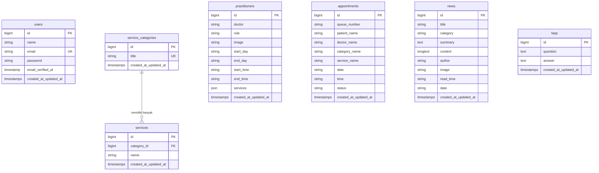
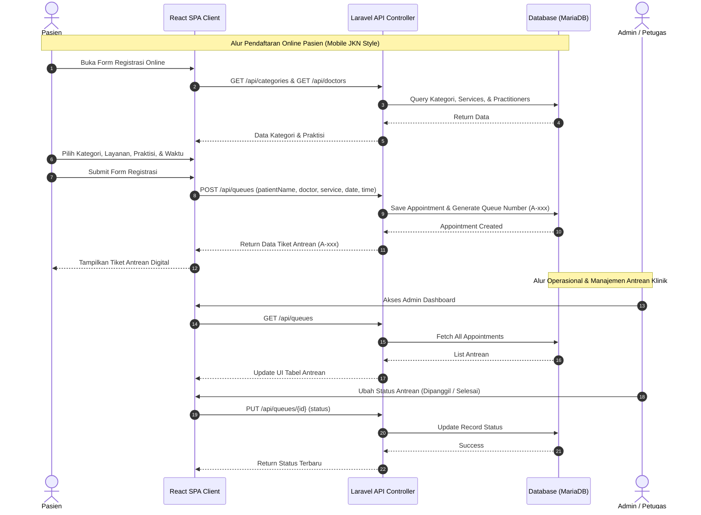

# JnC Family Care Metro - Sistem Informasi Pelayanan Pasien (Fokus Ibu & Anak)

Sistem Informasi Pelayanan Pasien Berbasis Website terpadu yang berfokus pada **Pelayanan Ibu dan Anak** (Klinik Meika Healthcare / JnC Family Care Metro). Sistem ini memfasilitasi pendaftaran pasien secara online maupun offline, pengelolaan slot antrean digital secara real-time, manajemen jadwal praktisi medis (dokter, bidan, terapis), manajemen kategori pelayanan resmi, serta modul administrasi klinik.

---

## 1. Overview

Sistem Informasi Pelayanan Pasien ini dikembangkan untuk mentransformasi operasional pelayanan kesehatan ibu dan anak menjadi modern, digital, dan efisien. Terinspirasi dari alur antrean Mobile JKN, platform ini memungkinkan pasien mendaftar dan memilih jam pelayanan dari rumah, serta mempermudah petugas klinik dan tenaga medis dalam mengelola pasien harian.

### Tujuan Utama Sistem:
- **Pendaftaran Mandiri Pasien**: Memudahkan pasien mendaftar online, memilih kategori pelayanan, memilih praktisi, dan mendapatkan nomor antrean digital.
- **Efisiensi Operasional Klinik**: Terintegrasi dari pendaftaran, pengelolaan jadwal praktisi, pemeriksaan/treatment, hingga pelaporan data antrean.
- **Pengalaman Pengguna Responsif (Mobile-First)**: Didesain khusus untuk smartphone dan desktop dengan antarmuka yang modern, cepat, intuitif, dan nyaman dipandang menggunakan warna identitas utama `#D896ED`.

---

## 2. Fitur Utama dan Keunggulan Sistem

### A. Fitur Pasien & Publik
- **Registrasi Online & Tiket Digital**: Pasien dapat melakukan pendaftaran online dan memperoleh tiket antrean digital dengan kode urut otomatis (misal: `A-014`).
- **Pencarian & Filtering Realtime**: Pencarian praktisi medis, jadwal aktif, dan jenis layanan secara langsung tanpa reload halaman.
- **Kategori Pelayanan Spesialis Ibu & Anak**: Mendukung 4 kategori pelayanan resmi klinik.
- **Edukasi & FAQ**: Pusat artikel/berita kesehatan ibu & anak serta tanya jawab umum seputar pelayanan faskes.

### B. Fitur Petugas & Administrasi (Admin Dashboard)
- **Manajemen Antrean (Queue Management)**: Melacak status antrean (`Menunggu Antrean`, `Dipanggil`, `Selesai`, `Dibatalkan`), menambah pendaftaran walk-in, dan mengedit data pasien.
- **Manajemen Kategori & Layanan**: Mengelola master data kategori pelayanan dan daftar layanan turunan.
- **Manajemen Praktisi Medis**: Pengelolaan data dokter, bidan, dan terapis beserta spesialisasi, foto, serta jam & hari praktik.
- **Manajemen Konten (Blog Editor & FAQ)**: Pembuatan dan pembaruan berita/artikel kesehatan serta daftar pertanyaan yang sering diajukan.

### C. Keunggulan Sistem
- **Mobile-First Experience**: Dirancang responsif dengan standar visual modern berbasis Tailwind CSS & React.
- **Single Page Application (SPA)**: Integrasi seamless antara Laravel API dan React JS via Vite untuk performa super cepat.
- **Multi-Deployment Ready**: Dilengkapi konfigurasi Docker (PHP Apache, MariaDB, phpMyAdmin) dan siap dijalankan pada lingkungan lokal maupun server produksi.

---

## 3. Struktur Direktori Blueprint

Berikut adalah gambaran struktur direktori proyek yang mengombinasikan backend Laravel 11/13 dan frontend React Vite:

```
project/
├── .docker/                         # Konfigurasi lingkungan Docker
│   └── vhost.conf                   # VirtualHost Apache
├── app/                             # Core Logic Backend Laravel
│   ├── Http/
│   │   ├── Controllers/
│   │   │   └── Api/                 # API Resource Controllers
│   │   │       ├── CategoryController.php
│   │   │       ├── DoctorController.php
│   │   │       ├── FaqController.php
│   │   │       ├── NewsController.php
│   │   │       └── QueueController.php
│   │   └── Middleware/
│   └── Models/                      # Eloquent ORM Models
│       ├── Appointment.php
│       ├── Faq.php
│       ├── News.php
│       ├── Practitioner.php
│       ├── Service.php
│       ├── ServiceCategory.php
│       └── User.php
├── bootstrap/                       # Bootstrapping Aplikasi Laravel
├── config/                          # Konfigurasi Aplikasi & Framework
├── database/                        # Database Schema & Data Initializer
│   ├── factories/                   # Model Factories
│   ├── migrations/                  # Database Migrations
│   │   ├── 0001_01_01_000000_create_users_table.php
│   │   └── 2026_08_11_000001_create_clinic_tables.php
│   └── seeders/                     # Seeder Data Bawaan
│       └── DatabaseSeeder.php
├── public/                          # Public Assets & Entrypoint (index.php)
├── resources/                       # Frontend Source Files
│   ├── css/
│   │   └── index.css                # Custom CSS & Tailwind Imports
│   ├── js/                          # React Application Architecture
│   │   ├── components/              # Reusable React UI Components
│   │   │   ├── BlogEditor/
│   │   │   ├── Button/
│   │   │   ├── Input/
│   │   │   ├── Nav/
│   │   │   └── PageWrapper/
│   │   ├── pages/                   # SPA Pages / Views
│   │   │   ├── AdminDashboard/      # Portal Admin & Manajemen
│   │   │   ├── LandingPage/         # Landing Page Utama Klinik
│   │   │   ├── Login/               # Halaman Autentikasi
│   │   │   ├── NewAppointment/      # Form Registrasi Online Pasien
│   │   │   └── UserDashboard/       # Portal Pasien & Riwayat Antrean
│   │   ├── services/                # API Client Service Helpers
│   │   ├── App.jsx                  # Main React Routing
│   │   └── main.jsx                 # React Entry Point
│   └── views/
│       └── app.blade.php            # Root Blade Shell for React SPA
├── routes/
│   ├── console.php
│   └── web.php                      # Routing API & Fallback SPA Route
├── storage/                         # Log & Storage File Aplikasi
├── tests/                           # Automated Tests (PHPUnit)
├── .env.example                     # Templat Variabel Lingkungan
├── Dockerfile                       # Container Build Directive (PHP 8.4 + Apache)
├── docker-compose.yml               # Multi-container Docker Orchestration
├── package.json                     # Frontend Dependencies & Scripts
├── composer.json                    # Backend Dependencies & Scripts
└── vite.config.js                   # Vite Build Configuration
```

---

## 4. Arsitektur Database (Schema)

Sistem menggunakan database relational (MariaDB / MySQL) dengan struktur tabel sebagai berikut:



### Detail Spesifikasi Tabel:

1. **`users`**: Menyimpan akun pengguna/administrator.
   - `id`, `name`, `email` (Unique), `password`, `email_verified_at`, `remember_token`, `timestamps`.
2. **`service_categories`**: Master 4 kategori pelayanan resmi ibu & anak.
   - `id`, `title` (Unique: Poli, Mom's Treatment, Persalinan, Pelayanan Bayi dan Anak), `timestamps`.
3. **`services`**: Detail jenis layanan pada tiap kategori.
   - `id`, `category_id` (Foreign Key ke `service_categories`), `name`, `timestamps`.
4. **`practitioners`**: Master data dokter, bidan, dan terapis.
   - `id`, `doctor` (nama lengkap & gelar), `role` (spesialisasi), `image`, `start_day`, `end_day`, `start_time`, `end_time`, `services` (JSON array jenis layanan), `timestamps`.
5. **`appointments`**: Data pendaftaran antrean pasien.
   - `id`, `queue_number` (kode antrean `A-xxx`), `patient_name`, `doctor_name`, `category_name`, `service_name`, `date`, `time`, `status` (Menunggu Antrean / Dipanggil / Selesai / Dibatalkan), `timestamps`.
6. **`news`**: Berita dan artikel edukasi kesehatan.
   - `id`, `title`, `category`, `summary`, `content`, `author`, `image`, `read_time`, `date`, `timestamps`.
7. **`faqs`**: Data pertanyaan umum dan jawaban resmi klinik.
   - `id`, `question`, `answer`, `timestamps`.

---

## 5. Alur Kerja Utama System (System Flow)



---

## 6. Validasi dan Logika Teknis Khusus

### A. Alur Registrasi & Slot Antrean (Mobile JKN Style)
1. **Penerbitan Nomor Antrean**: Generator nomor antrean secara otomatis membuat format kode `A-0xx` berdasarkan kombinasi nomor urut pendaftaran.
2. **Filtering Otomatis Kategori & Praktisi**:
   - Sistem mengambil relasi kategori dengan layanan (`ServiceCategory::with('services')`).
   - Praktisi difilter berdasarkan hari praktik (`start_day` s/d `end_day`) dan jam operasional (`start_time` s/d `end_time`).
3. **Pengelolaan Status Antrean**: Status antrean dapat bertransisi secara dinamis melalui API endpoint: `Menunggu Antrean` $\rightarrow$ `Dipanggil` $\rightarrow$ `Selesai` / `Dibatalkan`.

### B. Standardisasi 4 Kategori Pelayanan Resmi (Sesuai Spesifikasi Clinic):
- **Poli**: *Prenatal Class Yoga, Aquatic Yoga, Kelas Melahirkan, KB, Pemeriksaan/Konsultasi Catin, Pemeriksaan Nifas, Pemeriksaan Kehamilan, IVA, Papsmear, Washing V*.
- **Mom's Treatment**: *Special Pregnant Treatment, Treatment Laktasi, Treatment Babaran, Totok Wajah, Body Massage, Ratus V, Steambath, Lulur, Scrub, Creambath, Footbath*.
- **Persalinan**: *Pelayanan Persalinan, IMD (Inisiasi Menyusu Dini), Pendampingan Persalinan, DCC (Delayed Cord Clamping)*.
- **Pelayanan Bayi dan Anak**: *Baby Infant & Kids Massage, Massage Common Cold/Diare/Konstipasi/Kolik/Kembung, SHK, Konsultasi Tumbuh Kembang, MTBS/MTBM, Cukur Bayi, Jemur Bayi, Imunisasi, Baby Spa, Potong Kuku, Mandi Bayi, Cek Gol Darah, Hygiene Lidah/Telinga/Hidung, Tindik*.

### C. Aturan Design System & UI Constraints:
- **Warna Utama**: `#D896ED` (Soft Violet/Purple Accent).
- **Aturan Bebas Badge & Letter Spacing**: Bebas dari badge generik, tanpa pemakaian `uppercase` paksaan, dan tanpa `tracking-*` spacing.
- **Restriksi Penggunaan Icon**: Icon hanya diperbolehkan pada elemen interaktif (Tombol Aksi, Navigasi, Pencarian, Kalender, Notifikasi).

---

## 7. Dependensi Project

### A. Dependensi Backend (Composer / PHP)
- **`php`**: `^8.3` (atau PHP `8.2.12` / `8.4` Docker)
- **`laravel/framework`**: `^13.8` (Laravel 11/13 Framework Engine)
- **`laravel/tinker`**: `^3.0` (REPL CLI untuk Laravel)
- **`fakerphp/faker`**: `^1.23` (Generator mock data)
- **`laravel/pint`**: `^1.27` (PHP Code Style Fixer)
- **`phpunit/phpunit`**: `^12.5` (Testing Framework)

### B. Dependensi Frontend (NPM / Node.js)
- **`react`**: `^18.3.1` & **`react-dom`**: `^18.3.1` (UI Engine)
- **`react-router-dom`**: `^6.26.0` (SPA Client Routing)
- **`vite`**: `^5.0.0` (Fast Frontend Bundler)
- **`@vitejs/plugin-react`**: `^4.3.1` (Vite React Plugin)
- **`tailwindcss`**: `^4.0.0` & **`@tailwindcss/vite`**: `^4.0.0` (Utility-First CSS)
- **`concurrently`**: `^9.0.1` (Menjalankan dev server parallel)

---

## 8. Panduan Instalasi (Docker dan non Docker)

### Prasyarat Sistem
- Node.js versi 18+ & NPM
- Composer 2.x
- Git

---

### Metode A: Instalasi Menggunakan Docker (Rekomendasi)

Dengan Docker, Anda tidak perlu mengonfigurasi PHP atau database MySQL secara manual di sistem lokal.

1. **Clone Repositori**:
   ```bash
   git clone https://github.com/adistianherlambang/JnC-Family-Care-Metro-Patient-Management-Laravel-Vite.git
   cd JnC-Family-Care-Metro-Patient-Management-Laravel-Vite/project
   ```

2. **Salin File Environment**:
   ```bash
   cp .env.example .env
   ```

3. **Jalankan Container Docker**:
   ```bash
   docker compose up -d
   ```
   *Layanan Docker akan aktif di:*
   - **Web App (Laravel)**: [http://localhost:8000](http://localhost:8000)
   - **MariaDB Database**: `localhost:3306`
   - **phpMyAdmin**: [http://localhost:8081](http://localhost:8081)

4. **Jalankan Migrasi & Database Seeder di dalam Container**:
   ```bash
   docker exec -it laravel_app php artisan key:generate
   docker exec -it laravel_app php artisan migrate:fresh --seed
   ```

5. **Jalankan Vite Development Server (Lokal)**:
   ```bash
   npm install
   npm run dev
   ```

---

### Metode B: Instalasi Manual / Non-Docker

1. **Clone Repositori & Masuk Direktori Proyek**:
   ```bash
   git clone https://github.com/adistianherlambang/JnC-Family-Care-Metro-Patient-Management-Laravel-Vite.git
   cd JnC-Family-Care-Metro-Patient-Management-Laravel-Vite/project
   ```

2. **Install Dependensi Backend (Composer)**:
   ```bash
   composer install
   ```

3. **Install Dependensi Frontend (NPM)**:
   ```bash
   npm install
   ```

4. **Konfigurasi File Environment (`.env`)**:
   Salin `.env.example` menjadi `.env`:
   ```bash
   cp .env.example .env
   ```
   Sesuaikan konfigurasi database pada `.env`:
   ```env
   DB_CONNECTION=mysql
   DB_HOST=127.0.0.1
   DB_PORT=3306
   DB_DATABASE=pelayanan_pasien
   DB_USERNAME=root
   DB_PASSWORD=
   ```

5. **Generate Application Key & Inisialisasi Database**:
   Pastikan MySQL/MariaDB lokal (XAMPP / Laragon / Native) sudah berjalan, lalu buat database bernama `pelayanan_pasien`.
   ```bash
   php artisan key:generate
   php artisan migrate:fresh --seed
   ```

6. **Jalankan Aplikasi Mode Pengembangan**:
   Gunakan perintah `composer dev` untuk menjalankan Laravel Server dan Vite secara bersamaan:
   ```bash
   composer dev
   ```
   *Atau jalankan secara terpisah:*
   ```bash
   # Terminal 1: Laravel Backend
   php artisan serve

   # Terminal 2: Vite React Frontend
   npm run dev
   ```
   Akses aplikasi di browser pada: [http://localhost:8000](http://localhost:8000) atau `http://127.0.0.1:8000`.

---

## 9. Kredensial Akun Bawaan

Setelah melakukan perintah `php artisan db:seed` atau `migrate --seed`, akun administrator bawaan berikut akan otomatis tersedia di database:

| Role | Email | Password | Hak Akses |
|---|---|---|---|
| **Administrator Klinik** | `admin@meikahealth.id` | `admin123` | Akses penuh Dashboard Admin, Kelola Antrean, Kategori, Layanan, Dokter/Practitioner, Artikel Berita, & FAQ |

> **Catatan**: Data awal seeder juga menggenerasi master 4 kategori pelayanan resmi, daftar jenis layanan lengkap, 3 akun sampel praktisi medis (Dokter Spesialis Anak, Spesialis Kandungan, & Bidan Senior), antrean sampel, artikel berita kesehatan, serta sampel FAQ.

---

## 10. Ringkasan Tech Stack

| Komponen | Teknologi / Library | Versi / Keterangan |
|---|---|---|
| **Core Framework** | Laravel | v11.x / v13.x (PHP 8.3 / 8.4) |
| **Frontend UI Library** | React JS | v18.3.1 |
| **Client Router** | React Router DOM | v6.26.0 |
| **Frontend Build Tool** | Vite | v5.0.0 |
| **Styling Engine** | Tailwind CSS | v4.0.0 (Custom Color `#D896ED`) |
| **Database Server** | MariaDB / MySQL | MariaDB 10.4 / MySQL 8.0 |
| **Database Admin** | phpMyAdmin | v5.2.1 |
| **Containerization** | Docker & Docker Compose | Apache PHP 8.4 Container |
| **Testing** | PHPUnit | v12.5.12 |
| **API Pattern** | RESTful JSON API | Laravel ApiResource Controllers |

---
*Dikembangkan untuk Klinik Pelayanan Ibu & Anak - JnC Family Care Metro / Meika Healthcare.*
